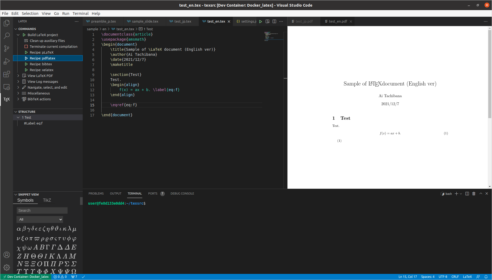
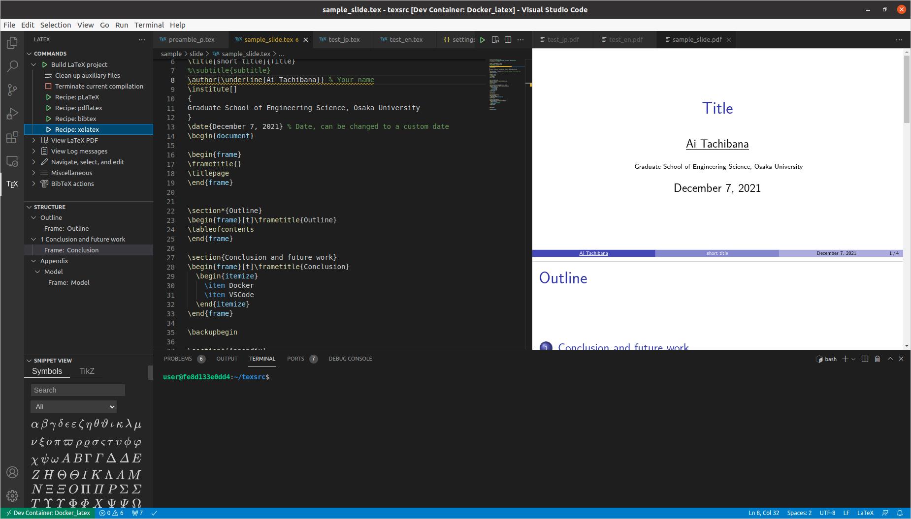

### 0. はじめに
現在，Ubuntu 20.04 上に TeXLive をインストールして LaTeX の文書を作成している．今後，仕事等で使うマシンが Windows になる可能性がある．そこで，OS に依らずに使える執筆環境として Docker Container を用いるものを作成した．

過去に同様の環境を作ってくれていた方の Docker image やブログを参考に作成した．作成したものは，GitHub の Public リポジトリ ([SeeKT/Docker_latex](https://github.com/SeeKT/Docker_latex)) にアップロードしている．

##### 目次
- 1 [採用しているコンパイルのルール](#section1)
- 2 [概要](#section2)
- 3 [ディレクトリ構成](#section3)
- 4 [使用方法](#section4)
- 5 [まとめ](#section5)

### 1. <a name="section1">採用しているコンパイルのルール</a>
- 日本語文書
    - `platex` + `dvipdfmx` (`latexmk` として記述)
    - `pbibtex`
- 英語文書
    - `pdflatex`
    - `bibtex`
- スライド (beamer)
    - `xelatex`
    - `bibtex` or `pbibtex`

### 2. <a name="section2">概要</a>
[Aruneno](https://github.com/aruneko) 様の [aruneko/texlive](https://hub.docker.com/r/aruneko/texlive) を使って，Docker Container として TeX の執筆環境を作成した．また，[Futa HIRAKOBA](https://github.com/korosuke613) 様の [爆速で日本語LaTeX執筆環境を用意する](https://korosuke613.hatenablog.com/entry/2019/06/24/171246) を参考にして，VSCode の LaTeX Workshop を用いたコンパイルの効率化をしている．この2つのサイトにはとてもお世話になった．とても感謝している．

### 3. <a name="section3">ディレクトリ構成</a>
[SeeKT/Docker_latex](https://github.com/SeeKT/Docker_latex) はこのようなディレクトリ構成をとっている．

```
|- .devcontainer/
|   |- .latexmkrc: latexmk の設定ファイル
|   |- devcontainer.json: VSCode の Remote Container 機能を使うときの設定
|   |- docker-compose.yml: コンテナの起動に対する処理
|   |- dockerfile: コンテナを作るための処理
|
|- .vscode/
|   |- setting.json: LaTeX Workshop の設定
```

`.vscode/setting.json` でコンパイル方法を指示することで，コンパイルの効率化を図っている．

### 4. <a name="section4">使用方法</a>
VSCode の Remote Development を用いて，コンテナ内に入る．そして，TeX ソースを開く．

日本語文書のコンパイルには，`platex` (`latexmk`) を使う．LaTeX Workshop の `Recipe: pLatex` をクリックし，`View LaTeX PDF` をクリックすると，右側に PDF ファイルが開かれる．


英語文書のコンパイルには，`pdflatex` を使う．LaTeX Workshop の `Recipe: pdflatex` をクリックし，`View LaTeX PDF` をクリックすると，右側に PDF ファイルが開かれる．




英語文書のコンパイルには，`xelatex` を使う．LaTeX Workshop の `Recipe: xelatex` をクリックし，`View LaTeX PDF` をクリックすると，右側に PDF ファイルが開かれる．



`.vscode/setting.json` を工夫すれば，一部の文書に対しては `pdflatex` みたいに設定できるらしいが，やり方がよく分からなかったので，今回はやらなかった．

### 5. <a name="section5">まとめ</a>
何故か上手くいかなくて悩んでいたが，TeX 本体をインストールするときを思い出したらなんとかいけた．時間かかったけど．

Docker Container としてプログラム (`R`, `Python`) の開発環境を作成した [資料](https://github.com/tcbn-ai/TIL/blob/main/Study_Docker/Docker_Environment/docker_environment.pdf) もあるので，一応リンクを貼っておく．