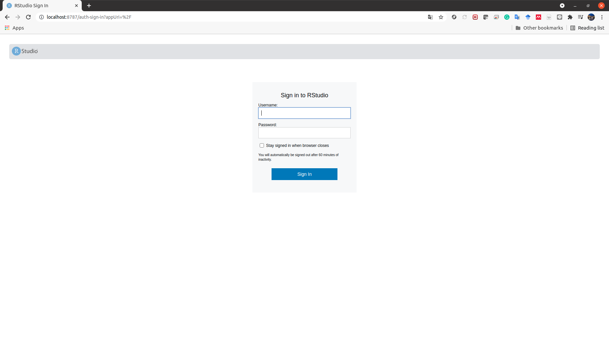

### 0. はじめに
RとRStudioもDocker containerとして使えれば少しめんどくさかったインストール工程 ([Ubuntu20.04にRとRStudioをインストールする](https://tachibana-ai.netlify.app/post/ubuntu_rstudio/)) をやらなくても良いのではないだろうか，と考えた．

調べたところ，RockerというものでRStudio ServerをDockerで使えるらしい[^1]．

[^1]:[R Docker tutorial](https://jsta.github.io/r-docker-tutorial/)

今回は備忘録として，Rockerを使ったときのメモを残すことにした．

### 1. 準備
最低限必要なことは，Docker Engineのインストールである．UbuntuへのDocker Engineのインストールは以前記事にした[^2]．WindowsやMacについては他にも様々な記事があると思う．

[^2]:[Ubuntu20.04にDocker Engineをインストールする](https://tachibana-ai.netlify.app/post/ubuntu_docker/)

### 2. 使い方
今回は，[`rocker/tidyverse`](https://hub.docker.com/r/rocker/tidyverse) を使う．おそらく`rocker/verse` なども同様の方法でできると思う．

まず，イメージファイルをローカルなマシンに落とす．これは，`docker pull` コマンドを用いればよい．
```bash
docker pull rocker/tidyverse
```

イメージファイルがあるかどうかは，次のコマンドで調べられる．
```bash
docker image ls | grep tidyverse
```

例えば，私のマシンで実行すると以下のように出力された．確かに `rocker/tidyverse` のイメージファイルがあることがわかる．
```bash
tcbn@tcbn-V530-15ICR:~$ docker image ls | grep tidyverse
rocker/tidyverse                                latest                  63d48e0c8338   9 days ago      2.41GB
```

イメージファイルがある状態で，以下のように `docker run` コマンドを実行すればバックグラウンドでRStudio Serverが立ち上がる．
```bash
docker run --rm -d -p 8787:8787 -e PASSWORD=[yourpasswordhere] -v [mountdir]:/home/rstudio rocker/tidyverse
```
ここで，それぞれのオプションは以下のようなものである．
- `--rm`: コンテナの終了後にコンテナを削除する．
- `-d`: 端末から切り離してバックグラウンドで実行する．
- `-p`: ポートマッピングを設定する．
  ```
  -p [port number (host)]:[port number (container)]
  ```
- `-e`: 環境変数を設定する．
- `-v`: ボリュームをマウントする．
  ```
  -v [host directory]:[container directory]
  ```

このコマンドの実行後，`http://localhost:8787/` にアクセスすればユーザ名とパスワードの入力画面が出てくる．そこで，ユーザ名に `rstudio` を入力し，パスワードに `-e` で指定したパスワードを入力する．

実際に私のマシンでやってみる．`~/r_sample` というディレクトリをマウントする．
```bash
tcbn@tcbn-V530-15ICR:~/r_sample$ ls
requirements.r  test.r
tcbn@tcbn-V530-15ICR:~/r_sample$ docker run --rm -d -p 8787:8787 -e PASSWORD=mypassword -v $(pwd):/home/rstudio rocker/tidyverse
83136d6a3c656386e74d14899e0ad55d4b10603ade1bad0dfe7dbde88e07e75c
```

この状態で，`http://localhost:8787/` にアクセスすると，以下のようにユーザ名とパスワードの入力画面が出てくる．



ユーザ名に `rstudio`，パスワードに指定したパスワードを入力し，サインインすると，次のような画面になる．


先程見た`~/rsample` がマウントされていることがわかる．あとは必要なパッケージをインストールするなどしたら使えるようになる．

コンテナ内のRStudio Server側でrのソースコードを書き換えるとそれがマウントしたローカルなディレクトリにも反映される．

今起動しているDocker containerを `docker ps` コマンドで見ると，
```bash
tcbn@tcbn-V530-15ICR:~/r_sample$ docker ps
CONTAINER ID   IMAGE              COMMAND   CREATED         STATUS         PORTS                                       NAMES
83136d6a3c65   rocker/tidyverse   "/init"   7 minutes ago   Up 7 minutes   0.0.0.0:8787->8787/tcp, :::8787->8787/tcp   inspiring_nash
```

となっている．コンテナを `docker stop` コマンドで終了した後に `docker ps -a` コマンドでコンテナ一覧を見る．
```bash
tcbn@tcbn-V530-15ICR:~/r_sample$ docker stop inspiring_nash 
inspiring_nash
tcbn@tcbn-V530-15ICR:~/r_sample$ docker ps -a | grep tidyverse
```

`--rm` オプションで指定したとおり，終了後のコンテナが削除されている．

### 3. まとめ
今回は，RStudio ServerをDockerで使うときのやり方を簡単にまとめた．例えば，`rocker/tidyverse` をイメージファイルに指定してDockerfileを作り，使いやすい環境を作るといったこともできる．