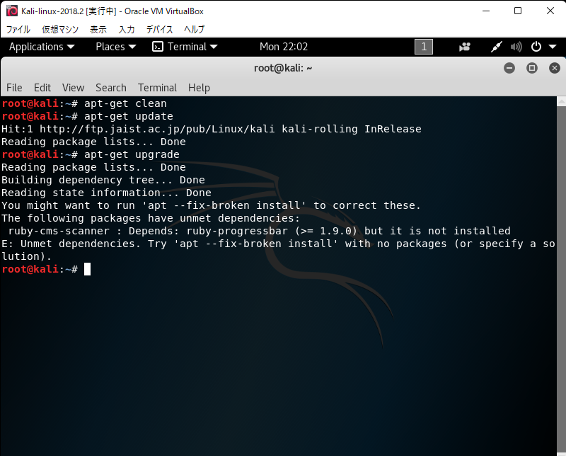
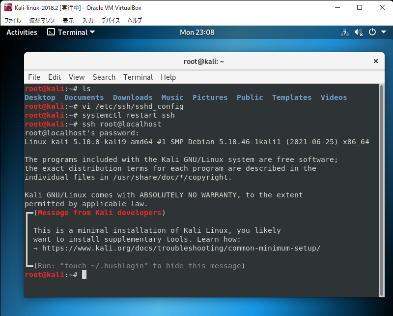

### 0. はじめに
[ハッキング・ラボのつくりかた](https://s-akademeia.sakura.ne.jp/main/books/lab/faq.html)という本を読み進めていたところ，最新版のKali linux 2021.2では実行できない部分があったので (4章, 252ページ等)，書籍の環境である Kali linux 2018.2に合わせることにした．インストールにかなり苦戦した．

後から気付いたが，```apt update```と```apt upgrade```をしてしまうとmetasploitも更新される．苦労してインストールしたが，同一の環境を作ることが目的であれば，実行しない方が良い．私はこの仮想マシンが翌日にグラフィカルモードで起動しなくなったので，消した．

このようなことは二度としないと思うが，自分への戒めとして，また，もし今後このような状況があったときに備えて記事に残すが，真似はしない方が良い．可能であれば安定起動版か最新版を入れた方が良いし，わざわざ少し古いバージョンを入れて更新するのは手間である．

#### 0.1. 概要
- インストール
    - DNSサーバに```8.8.8.8```を指定する
- 署名
    - ```archive.kali.org```から入手する
- 依存関係
    - ```ruby-http-parser.rb```の依存関係
        - ```apt-get install```する
    - ```thin```のエラー
        - ```/var/lib/dpkg/info```にある該当ファイルを削除して，```apt install```する
    - ```ruby-progressbar```のエラー
        - ```dpkg -i --force-overwrite```する

### 1. Kali linux 2018.2のインストール
ovaがないので，isoファイルをダウンロードする．ここでは，```kali-linux-2018.2-amd64.iso```を以下からダウンロードした．

- [Index of /kali-images](http://old.kali.org/kali-images/)

あとはVirtualboxで仮想マシンを入れるのと同様にすれば良いが，nameserverに```8.8.8.8```を指定することを忘れないようにする (名前解決の問題)．

### 2. インストール後の処理
#### 2.1. 署名
1でインストールしたkali linuxで```apt update```しようとすると，"The following signatures were invalid"のエラーが出る．


同様のエラーをStackExchangeで探し，同じように解決しようと試みた．

- 参考
    - [Invalid signature for Kali Linux repositories : “The following signatures were invalid: EXPKEYSIG ED444FF07D8D0BF6 Kali Linux Repository”](https://unix.stackexchange.com/questions/421821/invalid-signature-for-kali-linux-repositories-the-following-signatures-were-i)

```bash
gpg --keyserver hkp://keys.gnupg.net --recv-key 7D8D0BF6
gpg --fingerprint 7D8D0BF6
gpg -a --export 7D8D0BF6 | apt-key add -
apt update
```
と
```bash
wget -q -O - https://archive.kali.org/archive-key.asc | apt-key add
```
が紹介されていた．前者でうまくいかなかったので，後者を試した．


#### 2.2. 依存関係
```apt update```はできたので，```apt upgrade```しようとしたところ，```ruby-http-parser.rb```に依存関係の問題があるらしく，できなかった．


```ruby-http-parser.rb```をインストールすれば良いかもしれない．

- 参考
    - [Kali 'the following packages have unmet dependencies'](http://5.9.10.113/64784465/kali-the-following-packages-have-unmet-dependencies)


```bash
apt-get install ruby-http-parser.rb
```
を実行したところ，上のapt-listchangesが出力された．末尾まで見てqで進めた．途中に質問されたが，そのまま答えた．


最後まで進めたところ，エラーが出た．


とりあえず，```apt-get clean```と```apt-get -f install```をしてみることにしたが，同じエラーが残っている．


同様のエラーを解決している記事を発見したので，以下の記事のようにしてエラーを解消する．

- 参考
    - [【LIVA】【Ubuntu server14.04】apt-getでエラー発生（post-installationスクリプトエラー）](https://engetu21.hatenablog.com/entry/2014/12/06/004525)
    - [apt-getのpost-installationスクリプトエラー](http://ikkuntech.blogspot.com/2012/03/apt-get.html)

```bash
dpkg --audit
dpkg --configure thin
```


参考サイトによると，```/var/lib/dpkg/info```以下の関連するファイルを削除すれば良いらしい．

```bash
cd /var/lib/dpkg/info
rm -rf thin.postinst thin.postrm thin.prerm
```


この後に
```bash
dpkg --configure thin
```
をすれば良いらしいが，何故かうまくいかなかった．


仕方ないので，thinをインストールすることにした．
```bash
apt install thin
```


エラーが出なかったので，確認する．
```bash
dpkg -s thin
```


```Status install ok installed```になっているので，良さそう．

- 参考
    - [apt-getによる依存関係の解決方法](https://serverlog.jp/apt-get-dependence/)

```apt update```と```apt upgrade```を試す．

途中で"Configuring macchanger"と"sslh configuration"について聞かれたが，それぞれ"Yes"と"from inetd"にした．

また，"Configuring base-passwd"というのも聞かれた．今変更しなくても後から変更できるらしいので，"No"を選択した．


またエラーが出たので，原因を探す．とりあえず，```apt-get clean```とかを実行する．



"ruby-cms-scanner: "の行から，依存関係の問題があることが分かった．
```bash
apt install ruby-progressbar
```
でインストールしようとしたが，先ほどと同様のエラーが出た．


以下のサイトと類似しているエラーだったので，関連debを上書きインストールする方法を試してみた．

```bash
dpkg -i --force-overwrite /var/cache/apt/archives/ruby-progressbar_1.10.1-1_all.deb
apt --fix-broken install
```

- 参考
    - [apt --fix-broken installしろと言われた場合の対応](https://blog.tizen.moe/entry/2020/12/16/000000)

"Configuring postgresql-common"について聞かれたので，"Ok"とした．


いけたように見える．一応```apt update```と```apt upgrade```を確認する．


"not-upgraded"となっているが，一応エラーは消えているようなので，この処理は終了．

#### 2.3. ネットワーク設定
書籍第2章に合わせる．

- アダプター1
    - ホストオンリーアダプター
- アダプター2
    - NAT

Kali linux 2021.2に```10.0.0.2```を割り振っているので，Kali linux 2018.2には```10.0.0.3```を割り振る．


#### 2.4. ユーザの追加
"ai"というユーザを追加する．
```bash
useradd -m ai
passwd ai
usermod -a -G sudo ai
chsh -s /bin/bash ai
```


#### 2.5. ssh環境
##### (1) SSHホスト鍵の再生成
```bash
cd /etc/ssh
mkdir default_keys
mv ssh_host_* default_keys/
dpkg-reconfigure openssh-server
```

##### (2) sshdの起動
```bash
service ssh start
update-rc.d ssh enable
apt install sysv-rc-conf -y
```

##### (3) ログインできるか確認
ローカルから
```bash
ssh ai@localhost
```


Windows側から
```bash
ssh ai@10.0.0.3
```


どちらも接続できている．

##### (4) rootログインの許可
```/etc/ssh/sshd_config```を編集して
```bash
PermitRootLogin yes
```
にする．



##### (5) 公開鍵認証
Windows側で公開鍵があるディレクトリで，
```bash
scp .\id_rsa.pub root@10.0.0.3:/root/
```
とする．

kali linux側で，
```bash
cat id_rsa.pub >> ./.ssh/authorized_keys
chmod -R 700 ./.ssh/
chmod -R 600 ./.ssh/authorized_keys
```
を実行．

```/etc/ssh/sshd_config```の```PubkeyAuthentication```と```AuthorizedKeysFile```のコメントを外す．

Windows側の```.ssh/config```に以下を追加．
```txt
Host kali_2018
    HostName 10.0.0.3
    User root
    IdentityFile [authorized_keysに対応する秘密鍵のパス]
```

```bash
ssh kali_2018
```
でログインできることを確認する．

### 3. まとめ
kali linux 2018.2を導入し，初期設定をした．2018を入れたつもりだが，アップグレードされていた．結局消したが，苦労したので戒めとして残した．真似はしない方が良い．