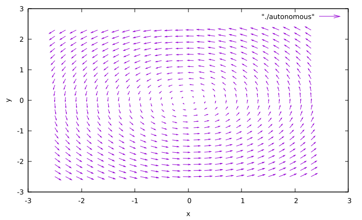
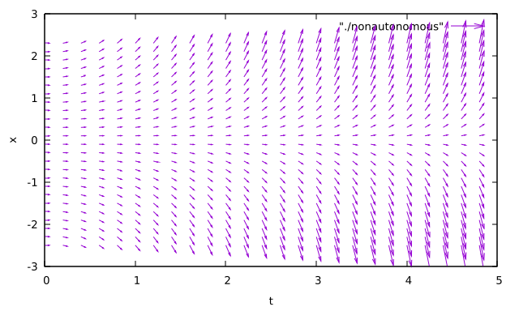
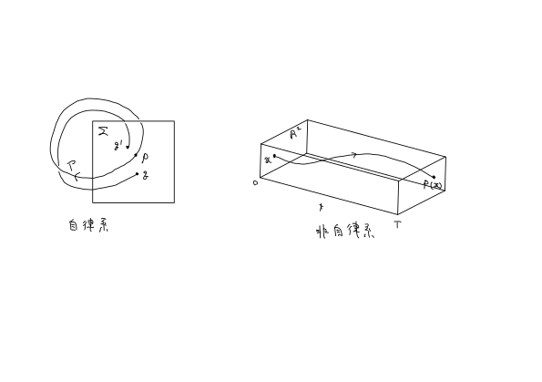

### 0. はじめに
この記事では，文献[^1]の第2章の内容をまとめた．

[^1]: 小室，[基礎からの力学系](https://www.saiensu.co.jp/book_support/sgc-17/)，サイエンス社，2002.

##### 目次
- 1 [連続時間力学系](#section1)
- 2 [離散時間力学系](#section2)
- 3 [ポアンカレ写像](#section3)
  - 3.1 [自律系のポアンカレ写像](#section3.1)
  - 3.2 [非自律系のポアンカレ写像](#section3.2)
- 4 [補足: プログラム](#section4)

### 1. <a name="section1">連続時間力学系 ― ベクトル場 ―</a>

この節では，通常の微分積分学の教科書で扱われる微分方程式の定義と，力学系理論で扱われる微分方程式との関係について扱う．独立変数を$t$とする．

###### Def 2.1
1. $F: D \ (\subset \mathbb{R}^{n + 2}) \to \mathbb{R}$: ($n + 2$) 変数実数値関数 $(n \geq 1)$
    $$
    F(t, x, x^{\prime}, \ldots, x^{(n)}) = 0 \tag{2.1}
    $$
    を **$n$階常微分方程式** という．
1. $f: D_0 \ (\subset \mathbb{R}^{n + 1}) \to \mathbb{R}$: ($n + 1$) 変数実数値関数
    $$
    x^{(n)} = f(t, x, x^{\prime}, \ldots, x^{(n - 1)}) \tag{2.2}
    $$
    を **正規形の$n$階常微分方程式** という．
1. $f_1, \ldots, f_n: D_0 \ (\subset \mathbb{R}^{n + 1}) \to \mathbb{R}$に対して，
$$
\begin{cases}
    \frac{dx_1}{dt} = f_1(t, x_1, \ldots, x_n) \\\ \cdots \\\ \frac{dx_n}{dt} = f_n(t, x_1, \ldots, x_n)
\end{cases} \tag{2.3}
$$
を **$1$階連立常微分方程式** (**常微分方程式系**) という．

$1$階連立常微分方程式は，$\boldsymbol{x} = (x_1, \ldots, x_n) \in \mathbb{R}^n$ および写像 $g: \mathbb{R} \times \mathbb{R}^n \to \mathbb{R}^n$,
$$
g(t, \boldsymbol{x}) = (f_1(t, x_1, \ldots, x_n), \ldots, f_n(t, x_1, \ldots, x_n)) \tag{2.4}
$$
によって，
$$
\frac{d \boldsymbol{x}}{dt} = g(t, \boldsymbol{x}) \tag{2.5}
$$
のように表される ($\mathbb{R}^n$における常微分方程式)．以下，$\dot{\boldsymbol{x}} := d\boldsymbol{x}/dt$とする．常微分方程式は，連続時間力学系を表現する代表的なモデルである．以降，常微分方程式をODEと略記する．

ODE (2.5) において，写像$g$が時間$t$を陽に含むか含まないかは，力学系理論での扱いに違いが生じる．写像$g$が時間$t$を陽に含まない場合を **自律系** といい，写像$g$が時間$t$を陽に含む一般の場合 (**非自律系**) と区別する．

###### Def 2.2 (自律系)
1. $\boldsymbol{x} := (x_1, \ldots, x_n) \in \mathbb{R}^n$とする．$f: D \ (\subset \mathbb{R}^n) \to \mathbb{R}$を，
    $$
    f(\boldsymbol{x}) = (f_1(\boldsymbol{x}), \ldots, f_n(\boldsymbol{x}))^{\mathrm{T}} \tag{2.6}
    $$
    とする．このとき，ODE
    $$
    \dot{\boldsymbol{x}}  = f(\boldsymbol{x}) \tag{2.7}
    $$
    $$
     \Longleftrightarrow \begin{cases}
        \dot{x}_1 = f_1(x_1, \ldots, x_n) \\\ \cdots \\\ \dot{x}_n = f_n(x_1, \ldots, x_n)
    \end{cases} \tag{2.8}
    $$
    を **自律系** という．
1. $D$を相空間，$D$の各点$\boldsymbol{x}$にベクトル$f(\boldsymbol{x})$を対応させる写像
    $$
    f: \boldsymbol{x} \mapsto f(\boldsymbol{x}) \tag{2.9}
    $$
    をベクトル場という．ベクトル場はODEを幾何学的に表現したもの．力学系の理論ではベクトル場はODEと同じ意味で使われることが多い．
1. 区間 $I \subset \mathbb{R}$ で定義された曲線 $\boldsymbol{x}: I \to \mathbb{R}^n$ が
    $$
    \dot{\boldsymbol{x}} = f(\boldsymbol{x}(t)) \tag{2.10}
    $$
    を満たすとき，$\boldsymbol{x}$はODE (2.7)の解 (解曲線) であるという．$\boldsymbol{x}(0)$: 初期値．ODEの解 $\boldsymbol{x}$ は，ベクトル場の **軌道** (orbit) とも呼ばれる．
1. $I \subset \mathbb{R}$ を $0$ を含む開区間，$D \subset \mathbb{R}^n$ とする．写像 $\varphi: I \times D \to \mathbb{R}^n$ が $\varphi(0, \boldsymbol{x}_0) = \boldsymbol{x}_0$ を満たし，各 $\boldsymbol{x}_0 \in D$ を固定するとき，
    $$
    \frac{d \varphi(t, \boldsymbol{x}_0)}{dt} = f(\varphi(t, \boldsymbol{x}_0)) \tag{2.11}
    $$
    を満たすならば，$\varphi$はODE (2.7)の **流れ** (flow) であるという (ベクトル場(2.9)の流れとも呼ばれる)．

###### Ex 2.1 (2次元自律微分方程式)
ここで，自律系について理解するために，2次元自律系微分方程式の例を考える．

1. $\boldsymbol{x} = (x, y)$, $f: \mathbb{R}^2 \to \mathbb{R}^2$を
    $$
    f(\boldsymbol{x}) = (f_1(x, y), f_2(x, y)) = (y, -x) \tag{2.12}
    $$
    で定義．このとき，
    $$
    \begin{cases}
        \dot{x} = y \\\ \dot{y} = -x
    \end{cases} \tag{2.13}
    $$
    は$f$によって与えられる自律系のODE．
1. ベクトル場は，$(x, y) \mapsto (y, -x)$である．相空間は$\mathbb{R}^2$．
  ベクトル場は以下の図のようになる．
  
1. 曲線$\boldsymbol{x}: \mathbb{R} \to \mathbb{R}^2$を
    $$
    \boldsymbol{x}(t) = (x_0 \cos t + y_0 \sin t, -x_0 \sin t + y_0 \cos t) \tag{2.14}
    $$
    で定義すれば，$\boldsymbol{x}$は初期値$(x_0, y_0)$を持つ解曲線となる．
1. $\varphi: \mathbb{R} \times \mathbb{R}^2 \to \mathbb{R}^2$を
    $$
    \varphi(t, x_0, y_0) = (x_0 \cos t + y_0 \sin t, -x_0 \sin t + y_0 \cos t) = (x_t, y_t) \tag{2.15}
    $$
    と定義．$\varphi$は上のODEの流れである．

次に，非自律系微分方程式について．

###### Def 2.3 (非自律系)
1. $g: I \times D \to \mathbb{R}^n$とする．
    - $I \subset \mathbb{R}$, $D \subset \mathbb{R}^n$
    $$
    g(t, \boldsymbol{x}) = (g_1(t, \boldsymbol{x}), \ldots, g_n(t, \boldsymbol{x}))^{\mathrm{T}} \tag{2.19}
    $$
    このとき，ODE
    $$
    \dot{\boldsymbol{x}} = g(t, \boldsymbol{x}) \tag{2.20}
    $$
    $$
     \Longleftrightarrow \begin{cases}
        \dot{x}_1 = g_1(t, x_1, \ldots, x_n) \\\ \cdots \\\ \dot{x}_n = g_n(t, x_1, \ldots, x_n)
    \end{cases} \tag{2.21}
    $$
    を **非自律系** (non-autonomous system) という．
1. $I \times D$: 拡大相空間．
    $$
    (t, \boldsymbol{x}) \mapsto (1, g(t, \boldsymbol{x})) \tag{2.22}
    $$
    をベクトル場という．
1. 曲線$\boldsymbol{x}: I \to \mathbb{R}^n$が
    $$
    \dot{\boldsymbol{x}} = g(t, \boldsymbol{x}(t)) \tag{2.23}
    $$
    を満たすとき，$\boldsymbol{x}$はODE (2.20) の解 (解曲線) という．$\boldsymbol{x}(t_0)$: 初期値．
1. $\varphi: \mathbb{R} \times \mathbb{R} \times \mathbb{R}^n \to \mathbb{R}^n$ が $\varphi(t_0, t_0, \boldsymbol{x}_0) = \boldsymbol{x}_0$ を満たし，各 $(t_0, \boldsymbol{x}_0) \in I \times D$ を固定するとき
    $$
    \frac{d \varphi(t, t_0, \boldsymbol{x}_0)}{dt} = g(t, \varphi(t, t_0, \boldsymbol{x}_0)) \tag{2.24}
    $$
    を満たすならば，$\varphi$はODE (2.20) の **流れ** であるという．

###### Ex 2.2 (1次元非自律微分方程式)
1. $(t, x) \in \mathbb{R} \times \mathbb{R}$, $g: \mathbb{R} \times \mathbb{R} \to \mathbb{R}$ を
    $$
    g(x, t) = xt \tag{2.25}
    $$
    で定義．このとき，
    $$
    \dot{x} = g(t, x) = xt \tag{2.26}
    $$
    は$g$によって与えられる非自律系のODE．
1. ベクトル場は$(t, x) \mapsto (1, xt)$．拡大相空間は$\mathbb{R} \times \mathbb{R}$．
  
1. 曲線$\boldsymbol{x}: \mathbb{R} \to \mathbb{R}$を
    $$
    \boldsymbol{x}(t) = x_0 \exp\left(\frac{1}{2}(t^2 - t_0^2) \right) \tag{2.27}
    $$
    で定義すれば，$\boldsymbol{x}$は$t = t_0$のとき，$x_0$を初期値とする解曲線となる．
1. 写像$\varphi: \mathbb{R} \times \mathbb{R} \times \mathbb{R} \to \mathbb{R}$を，
    $$
    \varphi(t, t_0, x_0) = x_0 \exp\left( \frac{1}{2}(t^2 - t_0^2) \right) \tag{2.28}
    $$
    で定義．この$\varphi$は上のODEの流れである．

### 2. <a name="section2">離散時間力学系 ― 写像 ―</a>
離散時間力学系を表現する代表的な数学モデルは離散時間差分方程式である．

###### Def 2.4
1. $\boldsymbol{x} = (x_1, \ldots, x_n)^{\mathrm{T}} \in \mathbb{R}^n$, $f: \mathbb{R}^n \to \mathbb{R}^n$: 連続写像.
    $$
    f(\boldsymbol{x}) = (f_1(\boldsymbol{x}), \ldots, f_n(\boldsymbol{x}))^{\mathrm{T}} \tag{2.30}
    $$
    このとき，離散時間差分方程式
    $$
    \boldsymbol{x}(t + 1) = f(\boldsymbol{x}(t)), \ \ (t = 0, 1, 2, \ldots) \tag{2.31}
    $$
    $$
    \Longleftrightarrow \begin{cases}
        x_1(t + 1) = f_1(x_1(t), \ldots, x_n(t)) \\\ \cdots \\\ x_n(t + 1) = f_n(x_1(t), \ldots, x_n(t))
    \end{cases} \tag{2.32}
    $$
    を **離散時間力学系** という．単に **写像** ということもある．
1. 点 $\boldsymbol{x}_0 \in \mathbb{R}^n$ に対して，

    $$\boldsymbol{x}_{t + 1} = f(\boldsymbol{x}_t), \ \ (t = 0, 1, 2, \ldots) \tag{2.33}$$
    で与えられる $\{\boldsymbol{x}_t: \ t = 0, 1, 2, \ldots\}$ を点 $\boldsymbol{x}_0$ を通る **正の半軌道** という．
1. $f$が同相写像 (逆写像$f^{-1}$が存在し，逆写像も連続) であるとき，**可逆系** といい，そうでないとき，**非可逆系** という．可逆系の場合には，時間の負の時間方向 (過去) への軌道も考えることができる．
    点$\boldsymbol{x}_0 \in \mathbb{R}^n$に対して，

    $$
    \boldsymbol{x}_{t - 1} = f^{-1}(\boldsymbol{x}_t) \ \ (t = 0, -1, -2, \ldots) \tag{2.34}
    $$
    で与えられる点列$\{\boldsymbol{x}_t: \ t = -1, -2, \ldots\}$を$\{\boldsymbol{x}_t: \ t = 0, 1, 2\}$に加えて得られる点列$\{\boldsymbol{x}_t: \ t = 0, \pm 1, \pm 2, \ldots\}$を$\boldsymbol{x}_0$を通る **軌道** という．

### 3. <a name="section3">ポアンカレ写像</a>
連続時間力学系における周期軌道の解析は，1次元低い次元の空間における離散時間力学系の解析に帰着されることがある．この離散時間力学系はポアンカレ写像と呼ばれる．

#### 3.1. <a name="section3.1">自律系のポアンカレ写像</a>
3次元自律系ベクトル場

$$
\dot{\boldsymbol{x}} = f(\boldsymbol{x}), \ \ \boldsymbol{x} \in \mathbb{R}^3 \tag{2.35}
$$

を考える．このベクトル場が周期軌道 $\Gamma$ を持つとする．
このとき，$\Gamma$ と1点 $\boldsymbol{p}$ で横断的に交わる2次元平面 $\Sigma$ をとる．

$\rightsquigarrow$ $\boldsymbol{p}$ は流れ $\varphi$ に沿って動く時，再び $\Sigma$ 上の点 $\boldsymbol{p}$ を打つ．

$\rightsquigarrow$ $\boldsymbol{p}$ に十分近い $\Sigma$ 上の点 $\boldsymbol{q}$ が流れに沿って動くとき， $\boldsymbol{p}$ の近くの点 $\boldsymbol{q}^{\prime}$ を打つと考えられる ($\because$ 解の連続性，$\Sigma$ が $\Gamma$ に横断的であること)．

上記のようにして， $\Sigma$ 上の $\boldsymbol{p}$ の近傍 $U$ から $\Sigma$ への写像が定義できる．

###### Def 2.5 
$U$: $\Sigma$ における $\boldsymbol{p}$ の近傍．$\boldsymbol{q} \in U$ に対して，$\boldsymbol{q}^{\prime}$ を流れ $\varphi$ によって

$$
\boldsymbol{q}^{\prime} = \varphi(T, \boldsymbol{q}), \ \ T = \min \\{t > 0 \ | \ \varphi(t, \boldsymbol{q}) \in \Sigma  \\} \tag{2.36}
$$

で定義する．この写像

$$
P: U \ni \boldsymbol{q} \mapsto \boldsymbol{q}^{\prime} \in \Sigma \tag{2.37}
$$

を自律系ベクトル場の **ポアンカレ写像** といい，$\Sigma$ を **ポアンカレ断面** という．

###### Remark
- ポアンカレ写像は有界な領域$U$で定義された写像

    $\rightsquigarrow$ $\boldsymbol{q}$に対して$P$で繰り返し変換すると，像が$U$の外に出てしまうことがある．

    $\rightsquigarrow$ 自律系のポアンカレ写像は，局所的に定義された離散時間力学系．

- ポアンカレ写像を使用する場面
    - パラメータを持つベクトル場の周期軌道の安定性の変化や分岐を調べるとき

        $\rightsquigarrow$ 周期軌道の安定性や分岐は，ポアンカレ写像の不動点$\boldsymbol{p}$の安定性や分岐に帰着される

        - あらかじめ定めたポアンカレ断面がパラメータのどの範囲で有効に働くかは，ベクトル場や周期軌道の性質に依存する

#### 3.2. <a name="section3.2">非自律系のポアンカレ写像</a>
時間に関して周期 $T$ の周期性を持つ2次元の非自律ベクトル場を考える．

$$
\dot{\boldsymbol{x}} = g(t, \boldsymbol{x}), \ \ \boldsymbol{x} \in \mathbb{R}^2 \tag{2.38}
$$
$$
g(t, \boldsymbol{x}) = g(t + T, \boldsymbol{x}) \tag{2.39}
$$

このベクトル場の流れを，$\varphi: \mathbb{R} \times \mathbb{R} \times \mathbb{R}^2 \to \mathbb{R}^2$ とする．

###### Def 2.6
$\boldsymbol{x} \in \mathbb{R}^2$に対して，$\varphi(T, 0, \boldsymbol{x}) \in \mathbb{R}^2$を対応させる写像
$$
P: \mathbb{R}^2 \ni \boldsymbol{x} \mapsto \varphi(T, 0, \boldsymbol{x}) \in \mathbb{R}^2 \tag{2.40}
$$
を非自律系の **ポアンカレ写像** (**ストロボ写像**) という．

ベクトル場の解 $\boldsymbol{x}: \mathbb{R} \to \mathbb{R}^2$ が $t = 0$ のとき $\boldsymbol{x} = \boldsymbol{x}_0$ を初期値とし， 

$$
\boldsymbol{x}(t) = \boldsymbol{x}(t + T), \ \ t \in \mathbb{R}  \tag{2.41}
$$

を満たすとき，$\boldsymbol{x}(0) = \boldsymbol{x}_0$ はポアンカレ写像 $P$ の不動点となる ($P(\boldsymbol{x}_0) = \boldsymbol{x}_0$)．

また，解 $\boldsymbol{x}: \mathbb{R} \to \mathbb{R}^2$ が $t = 0$ のとき， $\boldsymbol{x} = \boldsymbol{x}_0$ を初期値とし，

$$
\boldsymbol{x}(t) \neq \boldsymbol{x}(t + T) \tag{2.43}
$$
$$
\boldsymbol{x}(t) = \boldsymbol{x}(t + 2T) \tag{2.44}
$$
を満たすとき，$\boldsymbol{x}(0) = \boldsymbol{x}_0$ はポアンカレ写像 $P$ の2周期点となる．

$\rightsquigarrow$ 非自律系ベクトル場の基本周期 $T$ の整数倍の周期を持つ解曲線の解析を，ポアンカレ写像の周期点の解析に帰着させることができる．

自律系と非自律系のポアンカレ写像は，以下の図のように表される．

### 4. <a name="section4">補足: プログラム</a>
自律系と非自律系のベクトル場を描画する際に用いたプログラムはGitHub[^2]に上げている．

[^2]: https://github.com/tcbn-ai/TIL/tree/main/Study_Nonlinear_systems/code

### 5. <a name="section5">まとめ</a>
この記事では，力学系の定義についてまとめ，ベクトル場を描画した．