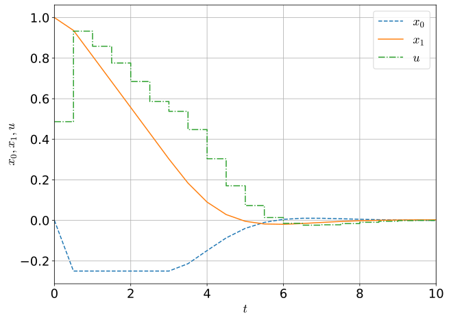

### 0. はじめに
先日，6章の内容をまとめた ([最適制御問題: 動的計画法と最小原理](/post/optimal_control_dp/))．7章の数値解法のあたりでかなり詰まってしまっていた．今回は他の文献も用いてまとめたいと思う．

理解が間違えている箇所もあるかもしれないので，ミスに気付いたら修正したいと思っている．

#### 0.1. 目次
- 1 [導入](#section1)
  - 1.1 [最適制御のアプローチ](#section1.1)
- 2 [直接法](#section2)
  - 2.1 [Direct Single Shooting](#section2.1)
  - 2.2 [Collocation](#section2.2)
  - 2.3 [Direct Multiple Shooting](#section2.3)
- 3 [実装](#section3)
- 4 [手書きメモ](#section4)
- 5 [まとめ](#section5)

### 1. <a name="section1">導入</a>
ここで扱う最適制御問題は，以下の形式をしているものとする．

$$\underset{x(\cdot), u(\cdot)}{\mathrm{minimize}} \ \ \varphi(x(T)) + \int_0^T L(x(t), u(t)) dt \tag{1}$$

subject to

$$\begin{cases} x(0) - x_0 = 0, & (\text{initial value}) \\\ \dot{x}(t) - f(x(t), u(t)) = 0, \ \forall t \in [0, T], & (\text{state equation}) \\\ h(x(t), u(t)) \geq 0, \ \forall t \in [0, T], & (\text{path constraints}) \\\ r(x(T)) = 0. & (\text{terminal constraints}) \end{cases}$$

例えば，ロボットがトルクや角度に関する制約を満たしながらある所望の終端状態になるように動作するというものはこのような問題として記述される．

#### 1.1. <a name="section1.1">最適制御のアプローチ</a>
最適制御問題の数値解法として，主に以下の3つのアプローチがある[^1]．
[^1]: M. Diehl, et al., "[Fast direct multiple shooting algorithms for optimal robot control](https://www.researchgate.net/publication/29603798_Fast_Direct_Multiple_Shooting_Algorithms_for_Optimal_Robot_Control)," Fast motions in biomechanics and robotics, pp. 66-93, Springer, 2006.  

1. Dynamic programming
1. Indirect methods
1. Direct methods

##### Dynamic programming (動的計画法)
- 最適性の原理を使用して任意の時刻$$t$$および任意の初期状態$$x_0$$に対するフィードバック制御を再帰的に計算する．
- 連続時間の場合，Hamilton-Jacobi-Bellman (HJB) 方程式という状態空間上の偏微分方程式が導かれる．
- 近似的に数値計算する方法はあるが，「次元の呪い」によって小さい次元に制限される．

##### Indirect methods (間接法)
- 無限次元の最適化の必要条件を使用して，常微分方程式の初期値境界値問題を導出する．
- "first optimize, then discretize"
- 変分法
- 初期値境界値問題を解くのが難しい．

##### Direct methods (直接法)
- 無限次元の最適化問題を有限次元の非線形計画問題に変換し，非線形計画問題を数値的に解く．
- "first discretize, then optimize"
- 制御軌道の有限次元のパラメータ化に基づく．

実世界への実装ではdirect methodsが広く用いられている．次節でdirect methodsについて簡単にまとめる．

### 2. <a name="section2">直接法</a>
直接法は，無限次元の最適制御問題 (1) を有限次元の非線形計画問題 (NLP) 

$$\underset{w}{\text{minimize}} \ a(w) \ \ \text{subject to} \  b(w) = 0, \ c(w) \geq 0 \tag{2}$$

に帰着させる方法である．ただし，$$w$$ は最適化の自由度を表す有限次元ベクトル，$$a$$ は微分可能関数 (スカラー)，$$b, c$$ は微分可能関数 (ベクトル) である． 直接法はまず制御軌道をパラメータ化するが，状態軌道の処理方法は"sequential" approach と "simultaneous" approachに分けられる．

##### Sequential approach
- 状態の軌道 $$x(t)$$ は制御入力 $$u(t)$$ と初期状態 $$x_0$$ の陰関数とみなされる．
- (例) Direct single shooting. ODE solverによるforward simulation.
- Simulationとoptimizationのiterationsは順番に進む．
- 離散化された制御入力が得られる．

##### Simultaneous approach
- 状態の軌道 $$x(t)$$ をNLP内の最適化変数として記述し，ODEモデルを表す等式制約を追加する．
- Simulationとoptimizationは同時に進行する．
- 制御入力の軌道に対応する状態の軌道がNLPの解として得られる．
- (例) Direct collocation, direct multiple shooting.

次に，直接法の代表的な3つの手法，(i) direct single shooting, (ii) direct collocation, (iii) direct multiple shooting の考え方についてまとめる．

#### 2.1. <a name="section2.1">Direct Single Shooting</a>
Single shootingではまず，制御入力を離散化する．評価区間$$[0, T]$$を$$0 = t_0 < t_1 < \cdots < t_N = T$$の$$N$$個に分割し，制御入力$$u(t)$$を

$$u(t) = q_i \ \ \text{for} \ \ t \in [t_i, t_{i + 1}]$$

のようにpiecewise constantになるようにする．つまり，$$u(t)$$は制御パラメータ$$q = (q_0, q_1, \ldots, q_{N - 1})$$にのみ依存し，$$u(t; q)$$と書くことができる．よって，初期値問題

$$x(0) = x_0, \ \dot{x}(t) = f(x(t), u(t; q)), \ \ \forall t \in [0, T]$$

を考え，$$t \in [0, T]$$における状態$$x(t)$$を従属変数として$$x(t; q)$$と表す．Direct single shootingは例えば下の図のように表される．

Semi-infinite problemにならないようにするために，Path constraintsも離散化することを考える．例えば，$$h(x(t), u(t)) \geq 0$$が点$$t_i$$でのみ成り立つようにする．

以上をまとめると，以下のような有限次元の非線形計画問題を得る．

$$\underset{q}{\text{minimize}} \ \ \varphi(x(T; q)) + \int_0^T L(x(t; q), u(t;q)) dt \tag{3}$$

subject to

$$\begin{cases} h(x(t_i; q), u(t_i; q)) \geq 0, \ \ i = 0, \ldots, N & (\text{discretized path constraints}) \\\ r(x(T; q)) = 0 & (\text{terminal constraints}) \end{cases}$$

この問題は有限次元の最適化ソルバで解くことができる．例えば，[IPOPT](https://github.com/coin-or/Ipopt)[^2] (主双対内点法という方法を利用した連続最適化問題を解くライブラリ) などを用いることができる．

[^2]:A. Wächter and L. T. Biegler, "[On the Implementation of a Primal-Dual Interior Point Filter Line Search Algorithm for Large-Scale Nonlinear Programming](https://link.springer.com/article/10.1007%2Fs10107-004-0559-y)," Mathematical Programming vol. 106, no. 1, pp. 25-57, 2006 ([preprint](http://www.optimization-online.org/DB_HTML/2004/03/836.html))

##### Direct single shootingの利点
1. 最先端のODEまたはDAEソルバーを使用できること．
1. 大規模なODEまたはDAEシステムでも最適化の自由度が少ないこと．
1. 必要なことが制御入力の自由度の初期推定のみであること．

##### Direct single shootingの欠点
1. 初期化で状態の軌道$x$の知識を使用できない．
1. ODEの解$x(t; q)$が$q$の非線形性に依存する可能性がある．

実装の容易さなどからsingle shooting approachは工学的応用の観点ではよく用いられる．

#### 2.2. <a name="section2.2">Collocation</a>
ここでは，collocationの考え方について簡単にまとめる．まず，制御入力と状態を離散化する．特に，制御入力が各$$[t_i, t_{i + 1}]$$で$$q_i$$である (piecewise constantである) ように選ぶ．また，点$$t_i$$における状態が$$s_i \approx x(t_i)$$であるとする．

このとき，無限次元のODE

$$\dot{x}(t) - f(x(t), u(t)) = 0, \ \ t \in [0, T]$$

は有限個の等式制約

$$c_i(q_i, s_i, s_i^{\prime}, s_{i + 1}) = 0, \ \ i = 0, \ldots, N - 1$$

に置き換えられる．ただし，$$s_i^{\prime}$$は区間$$[t_i, t_{i + 1}]$$中の "collocation points" における状態の軌道を表すものとする．これらの点の位置を適切に選択することで，高いオーダーでの近似が達成される．通常$$s_i^{\prime}$$は直交多項式の零点になるように選ばれる．

ここでは簡単のため，中間変数$$s_i^{\prime}$$が存在しない場合について述べる．このとき，追加の等式制約は以下のように表される．

$$c(q_i, s_i, s_{i + 1}) := \frac{s_{i + 1} - s_i}{t_{i + 1} - t_i} - f\left( \frac{s_i + s_{i + 1}}{2}, q_i \right).$$

次に，collocation intervals内の積分を近似する．例えば，

$$l_i(q_i, s_i, s_{i + 1}) := L\left( \frac{s_i + s_{i + 1}}{2}, q_i \right) (t_{i + 1} - t_i) \approx \int_{t_i}^{t_{i + 1}} L(x(t), u(t)) dt$$

のようにする．このような離散化をすると，巨大だがスパースなNLPを得る．

$$\underset{s, q}{\text{minimize}} \ \ \varphi(s_N) + \sum_{i = 0}^{N - 1} l(q_i, s_i, s_{i + 1})$$

subject to

$$\begin{cases} s_0 - x_0 = 0, & (\text{fixed initial value}) \\\ c_i(q_i, s_i, s_{i + 1}) = 0, \ i = 0, \ldots, N - 1, & (\text{discretized ODE model}) \\\ h(s_i, q_i) = 0, \ i = 0, \ldots, N, & (\text{discretized path constraints}) \\\ r(s_N) = 0. & (\text{terminal constraints}) \end{cases}$$

この問題は内点法を用いたソルバで解くことができる．効率的なNLPの手法では通常，反復が実行可能に保たれないので，離散化されたODE modelの方程式はNLPの解でのみ満たされる．つまり，simulationとoptimizationが同時に進行する．

##### Collocation methodsの利点
1. 非常にスパースなNLPが得られること．
1. 初期化で状態軌道$$x$$の知識を使用できること．
1. 局所収束が高速であること．
1. 不安定なシステムを扱うことができること．
1. 状態と終端制約の処理が容易であること．

##### Collocation methodsの欠点
- 離散化の誤差を適応的に制御しようとすると，再度grid化を行う必要があり，NLPの次元を変更する必要があること．
  - そのため，collocationのapplicationでは適切な離散化誤差の制御の問題に対処しないことがよくある．

Collocation methodsは実用的な最適制御問題にも使われている．

#### 2.3. <a name="section2.3">Direct Multiple Shooting</a>
Direct multiple shooting methodは，simultaneous method (e.g. collocation) とsingle shootingの利点を組み合わせ，adaptive, error controlled ODE solversを使えるようにしたものである．

まず，制御入力を

$$u(t) = q_i \ \ \text{for} \ \ t \in [t_i, t_{i + 1}]$$

のようにpicewise constantになるようにする．ただし，$$t_i$$と$$t_{i + 1}$$の間隔はsingle shootingと同じになるようにする．

次に，各時間区間$$[t_i, t_{i + 1}]$$において独立に，人工的な初期値$$s_i$$からODEを解く．

$$\dot{x}_i(t) = f(x_i(t), q_i), \ \ t \in [t_i, t_{i + 1}],$$

$$x_i(t_i) = s_i.$$

ここまでで得られる制御入力と軌道は，例えば下の図のようになる．

この初期値問題を数値的に解くことによって，軌道$$x(t; s_i, q_i)$$を得る．このODEの解の計算と同時に積分

$$l_i(s_i, q_i) := \int_{t_i}^{t_{i + 1}} L(x_i(t_i; s_i, q_i)) dt$$

を数値的に計算する．

人工的な変数$$s_i$$を物理的に意味のある値に拘束するために，連続性の条件

$$s_{i + 1} = x_i(t_{i + 1}; s_i, q_i)$$

を課す．このようにして，single shootingで得られたNLPと等価でありながら，余剰の変数$s_i$を含み，block sparse structureを持つNLPの定式化を得る．

$$\underset{s, q}{\text{minimize}} \ \ \varphi(s_N) + \sum_{i = 0}^{N - 1} l_i(s_i, q_i) \tag{4}$$

subject to 

$$\begin{cases} s_0 - x_0 = 0, & (\text{initial value}) \\\ s_{i + 1} - x_i(t_{i + 1}; s_i, q_i) = 0, \ \ i = 0, \ldots, N - 1, & (\text{continuity}) \\\ h(s_i, q_i) \geq 0, \ \ i = 0, \ldots, N, & (\text{discretized path constraints}) \\\ r(s_N) = 0. & (\text{terminal constraints}) \end{cases}$$

すべての変数を$$w := (s_0, q_0, s_1, q_1, \ldots, s_N)$$とまとめると，(2)の形式のNLPを得る．

Direct multiple shootingは，sequential methodとsimultaneous methodの利点を両方持つ．オフラインの最適制御問題の数値計算の他，オンライン最適化やMPCにも応用されている．

### 3. <a name="section3">実装</a>
以下の例題を数値的に解く．

$$\underset{x(\cdot) \in \mathbb{R}^2, u(\cdot) \in \mathbb{R}}{\text{minimize}} \ \ \int_0^T (x_1^2 + x_2^2 + u^2) dt$$

subject to

$$\begin{cases} x(0) = x_0, & (\text{initial value}) \\\ \dot{x}_0 = (1 - x_1^2)x_0 - x_1 + u, \ \ \dot{x}_1 = x_0 \ \ t \in [0, T], & (\text{state equation})  \\\ x_1 \geq -0.25, |u(t)| \leq 1, \ \ t \in [0, T], & (\text{bounds}) \end{cases}$$

初期値を$$x_0 = [0, 1]^{\mathrm{T}}$$とし，$$T = 10, N = 20$$とする．

[CasADi](https://web.casadi.org/)[^3] を用いてdirect single shooting methodを実装した．実装したコードは[最適制御問題: 直接法 (プログラム)](/post/optimal_control_direct_method/) に載せている．

[^3]:J. A. E.Andersson, et al, "[CasADi - A software framework for nonlinear optimization and potimal control](https://link.springer.com/article/10.1007/s12532-018-0139-4)," Mathematical Programming Computation, In Press, 2018.

実行後得られた最適制御および状態を以下に示す．

### 4.<a name="section4">手書きメモ</a>
非線形最適制御問題入門[^4]の7章では，最適制御問題の数値解法がいくつか紹介されている．

| 数値解法 | 長所 | 短所 | 適する用途 |
| ---- | ---- | ---- | ---- |
| 勾配法 | $H$の高階導関数が不要 | 最適解近傍での収束が遅い | 最適解のおおよその様子を手軽に知りたいとき |
| シューティング法 | 未知量が有限次元 | 計算が発散しやすい | 良好な初期推定解が選べるとき |
| 入力関数のニュートン法 | 最適解近傍での収束が速い | $H$の2階偏導関数が必要で，各反復での計算量が多い | 最適解を精度よく求めたいとき |
| 動的計画法 | 状態フィードバック制御が得られる | 状態の次元が高いと記憶量が膨大 | 状態の次元が低いか，狭い範囲だけ考慮すればよいとき |

以下に手書きメモを掲載する．

[^4]:大塚，[非線形最適制御問題入門](https://www.coronasha.co.jp/np/isbn/9784339033182/)，コロナ社，2011.

- [7.1節](/files/optimal_control/Sec7.1.pdf)
- [7.2節](/files/optimal_control/Sec7.2.pdf)
- [7.3節](/files/optimal_control/Sec7.3.pdf)
- [7.4節-7.6節](/files/optimal_control/Sec7.4-7.6.pdf)

### 5.<a name="section5">まとめ</a>
この記事では，最適制御の数値解法について簡単にまとめ，例題を数値的に解いた．理解が間違えている箇所があるかもしれないので，もう一度確認したいと思っている．