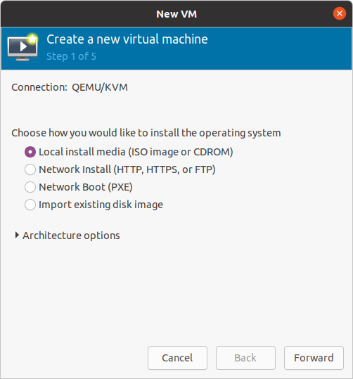
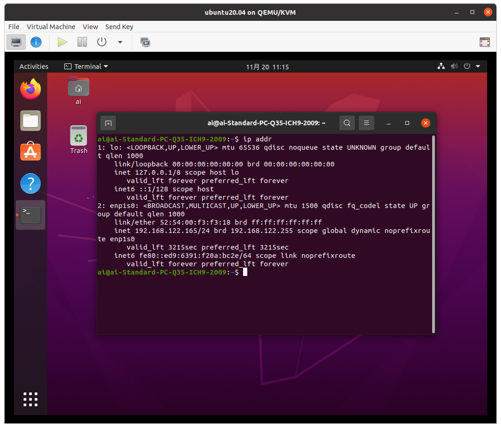

### 0. はじめに
Linux の試験を受けようと考えている．普段家で使っている OS は Ubuntu 20.04 であるが，試験勉強用の環境を普段使っている OS とは隔離された形で作りたいと思った．

そこで，今回は Ubuntu の仮想化機能である KVM を用いて仮想マシンを作成する．あくまで試験勉強用の環境であり，一般用途として使う際に適しているとは限らない．

##### 目次
- 1 [構成と仕様](#section1)
- 2 [KVM の導入と仮想マシンの作成](#section2)
  - 2.1 [KVM の導入](#section2-1)
  - 2.2 [仮想マシンの作成](#section2-2)
- 3 [SSH 接続の設定](#section3)
- 4 [まとめ](#section4)

### 1. <a name="section1">構成と仕様</a>
試験では Debian 系の OS と Red Hat 系の OS の両方の知識が求められると考えられるので，両方を導入する．Debian 系 OS として Ubuntu 20.04 を導入し，Red Hat 系 OS として CentOS 7 を導入する．

また，練習用途として利用するために，次のようなことを求める．

- インターネットに接続できる．
- ホスト OS と ssh で接続できる．

### 2. <a name="section2">KVM の導入と仮想マシンの作成</a>
#### 2.1. <a name="section2-1">KVM の導入</a>
仮想化機能の KVM を導入する (参考:[How to Install KVM on Ubuntu 20.04](https://www.tecmint.com/install-kvm-on-ubuntu/))．

```
(Host)
sudo apt -y install virt-manager qemu-system
```

KVM をインストールすると，デフォルトで `virbr0` というブリッジが作成される (参考: [KVMでゲストOSをブリッジ接続する](https://qiita.com/yoshiyasu1111/items/8d07a4fd55116fba07f7))．

```
(Host)
tcbn@tcbn-V530-15ICR:~$ ifconfig virbr0
virbr0: flags=4099<UP,BROADCAST,MULTICAST>  mtu 1500
        inet 192.168.122.1  netmask 255.255.255.0  broadcast 192.168.122.255
        ether 52:54:00:fe:91:8f  txqueuelen 1000  (Ethernet)
        RX packets 291159  bytes 16410705 (16.4 MB)
        RX errors 0  dropped 0  overruns 0  frame 0
        TX packets 582378  bytes 822922760 (822.9 MB)
        TX errors 0  dropped 0 overruns 0  carrier 0  collisions 0
```

`192.168.122.0` というネットワークであり，ホスト OS は `192.168.122.1` という IP address でゲスト OS と接続できる．

#### 2.2. <a name="section2-2">仮想マシンの作成</a>
##### 手順
まず，ISO ファイルを入手する．
- [Ubuntu 20.04](https://jp.ubuntu.com/download)
- [CentOS 7](https://www.centos.org/download/)

```
(Host)
virt-manager
```
で virt-manager を起動し，"Create a new virtual machine" を選択する．基本的に手順にしたがって新しい仮想マシンを作成する．ネットワークは，Virtual network 'default': NAT を選択する (これを選択するとインターネットに接続できたため．他の方法もあるだろう)．




あとは通常の OS のインストールと同様の操作である．

### 3. <a name="section3">SSH 接続の設定</a>
以降，Ubuntu での操作を載せる．CentOS は異なるコマンドだが，同様の操作をすることで実現できる．

OS のインストール後は `update` と `upgrade` を行う．
```
(Guest)
sudo apt update && sudo apt -y upgrade
```

次に，SSH 接続のために OpenSSH Server を導入する．
```
(Guest)
sudo apt -y install openssh-server
```
また，`ssh.service` が active か，マシンの起動後に active になるか (enable か) を確認する．

```
(Guest)
sudo systemctl is-enabled ssh
sudo systemctl status ssh
```


ゲスト OS の IP address を `ip addr` で確認する．



今回，Ubuntu 20.04 には `192.168.122.165` という IP address が割り当てられている．この IP address は [DHCP](https://www.nic.ad.jp/ja/basics/terms/dhcp.html#:~:text=DHCP%E3%81%A8%E3%81%AF%E3%80%8CDynamic%20Host,%E8%A1%8C%E3%81%86%E3%81%9F%E3%82%81%E3%81%AE%E3%83%97%E3%83%AD%E3%83%88%E3%82%B3%E3%83%AB%E3%81%A7%E3%81%99%E3%80%82&text=%E3%81%AA%E3%81%8ADHCP%E3%81%AB%E3%81%AF%E8%AA%8D%E8%A8%BC,%E3%81%AB%E5%AF%BE%E3%81%97%E3%81%A6%E8%84%86%E5%BC%B1%E3%81%A7%E3%81%99%E3%80%82) で割り当てられたものである[^1]．

[^1]: IP address を固定しようと思ったが，固定するとインターネット接続ができなくなったので DHCP で割り当てられた IP address を用いることにした．原因が分からなかったので，いずれ調べたいと思う．

ホスト OS とゲスト OS 間の接続ができるかどうか，確認する．

ホスト OS → ゲスト OS:
```
tcbn@tcbn-V530-15ICR:~$ ping -c 3 192.168.122.165
PING 192.168.122.165 (192.168.122.165) 56(84) bytes of data.
64 bytes from 192.168.122.165: icmp_seq=1 ttl=64 time=0.544 ms
64 bytes from 192.168.122.165: icmp_seq=2 ttl=64 time=0.201 ms
64 bytes from 192.168.122.165: icmp_seq=3 ttl=64 time=0.366 ms

--- 192.168.122.165 ping statistics ---
3 packets transmitted, 3 received, 0% packet loss, time 2043ms
rtt min/avg/max/mdev = 0.201/0.370/0.544/0.140 ms
```

ゲスト OS → ホスト OS:


両方向に接続できていることが確認される．

SSH 接続を行う．学習用環境なので，パスワード認証で十分だろう． ホスト OS 側で `ssh [username]@[IP address]` とする．初回接続時は確認が出るが，yes を選択する．
```
(Host)
tcbn@tcbn-V530-15ICR:~$ ssh ai@192.168.122.165
ai@192.168.122.165's password: 
Welcome to Ubuntu 20.04.3 LTS (GNU/Linux 5.11.0-40-generic x86_64)

 * Documentation:  https://help.ubuntu.com
 * Management:     https://landscape.canonical.com
 * Support:        https://ubuntu.com/advantage

0 updates can be applied immediately.

Your Hardware Enablement Stack (HWE) is supported until April 2025.
Last login: Sat Nov 20 09:08:44 2021 from 192.168.122.1
```

毎回このコマンドを打つのは面倒 (特に，公開鍵認証を用いている場合) なので，ホスト OS 側の `~/.ssh/config` ファイルに設定を書く (パスはこれではない可能性もある)．

```
Host Host_name
    HostName [IP address]
    User [username]
```

という書式である (参考: [ssh_config(5) - Linux man page](https://linux.die.net/man/5/ssh_config))．`ssh Host_name` で接続できる[^2]．

[^2]: VS Code に優秀な拡張機能 Remote - SSH があるので，使うのをおすすめする．接続先のファイルをまるで手元で扱っているかのように編集できる．

### 4. <a name="section4">まとめ</a>
学習用の環境を仮想マシンで作った．特にインターネット接続あたりで詰まったので，備忘録としてまとめた．